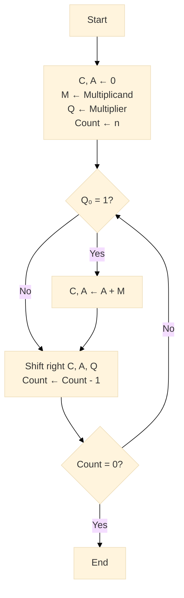
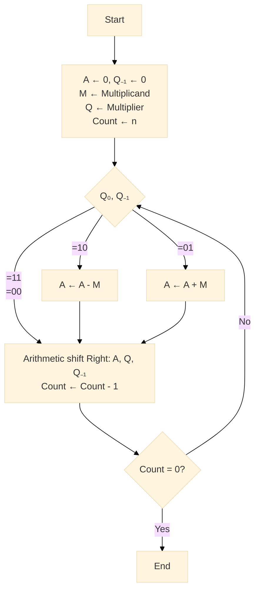
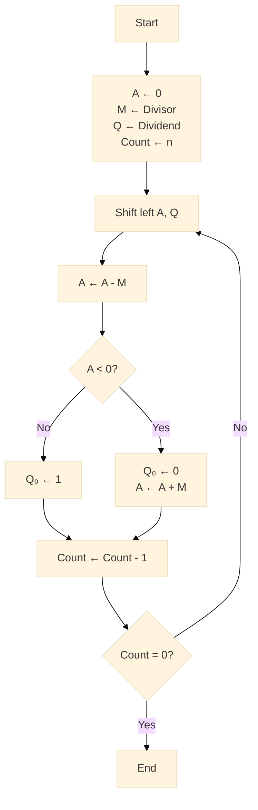

# 1 整数先修课：为什么整数"乖乖听话"

在深入浮点数之前，我们需要先理解整数的表示和运算。整数之所以"乖乖听话"，是因为它们有精确的二进制表示和可靠的运算规则。

## 1.1 二进制补码整数表示

### 1.1.1 表示范围

二进制补码整数的表示范围：
$$
-2^{n-1}\ ---------\ 0\ ----------\ 2^{n-1} - 1
$$

其中 n 是位数。

### 1.1.2 8位补码示例

| 概念  | 8 位补码示例           | 数学范围       |
| --- | ----------------- | ---------- |
| 无符号 | 200 = `1100 1000` | 0 … 255    |
| 补码  | ‑5 = `1111 1011`  | ‑128 … 127 |

**补码规则**：
- 正数：直接转换为二进制
- 负数：按位取反后加1

## 1.2 整数四则运算一步一步演示

### 1.2.1 加法(7 + (-3))

| 步骤      | 十进制 | 二进制（8 位）                  | 说明           |
| ------- | --- | ------------------------- | ------------ |
| 写原数     | 7   | `0000 0111`               |              |
| 写 -3 补码 | -3  | `1111 1101`               | 按位取反后加 1     |
| 逐位相加    |     | `0000 0111` + `1111 1101` | 二进制全加器       |
| 进位丢弃    |     | `1 0000 0100`             | 第 9 位溢出 → 丢弃 |
| 结果      | 4   | `0000 0100`               | 无舍入，完全精确     |

**关键点**：补码加法会自动处理符号，溢出位被丢弃，结果完全精确。

### 1.2.2 减法(7 - 3)

硬件把 7 - 3 变成 7 + (-3)，完全复用加法器。

**优势**：
- 硬件设计简单，只需要加法器
- 减法运算转换为加法运算
- 统一的运算单元

### 1.2.3 乘法(11 × 13)

$$
M \times Q
$$

- M=11: 被乘数
- Q=13: 乘数

#### 1.2.3.1 常规算法(unsigned int)

| C | A    | Q    | M    | 备注                    |
|---|------|------|------|----------------------------|
| 0 | 0000 | 1101 | 1011 | 初始值                    |
| 0 | 1011 | 1101 | 1011 | 第一个周期（Add）           |
| 0 | 0101 | 1110 | 1011 | 第一个周期（Shift）         |
| 0 | 0010 | 1111 | 1011 | 第二个周期（Shift）         |
| 0 | 1101 | 1111 | 1011 | 第三个周期（Add）           |
| 0 | 0110 | 1111 | 1011 | 第三个周期（Shift）         |
| 1 | 0001 | 1111 | 1011 | 第四个周期（Add）           |
| 0 | 1000 | 1111 | 1011 | 第四个周期（Shift）         |

**结果**：1000 1111 = 143

**算法流程**：

**算法步骤**：
1. 检查乘数最低位Q₀
2. 如果Q₀=1，则A ← A + M
3. 右移C、A、Q
4. 重复n次

#### 1.2.3.2 布斯(Booth)算法(signed int)

布斯算法用于有符号整数的乘法，通过观察相邻位来减少加法次数。

**布斯算法示例**：计算 3 × 7

| A      | Q      | Q₋₁ | M      | 备注                     |
|--------|--------|-----|--------|------------------------------|
| 0000   | 0011   | 0   | 0111  | 初始值                     |
| 1001   | 0011   | 0   | 0111  | 第一个周期 A ← A - M        |
| 1100   | 1001   | 1   | 0111  | 第一个周期 Shift             |
| 1110   | 0100   | 1   | 0111  | 第二个周期 Shift             |
| 0101   | 0100   | 1   | 0111  | 第三个周期 A ← A + M        |
| 0010   | 1010   | 0   | 0111  | 第三个周期 Shift             |
| 0001   | 0101   | 0   | 0111  | 第四个周期 Shift             |

**最后结果**：0001 0101 = 21

**布斯算法优势**：
- 减少加法次数
- 支持有符号数
- 硬件实现效率高

### 1.2.4 除法(unsigned int)

$$
Q / M
$$

- Q=7: 被除数
- M=3: 除数

**除法算法流程**：

**除法算法步骤**：
1. 左移A、Q
2. A ← A - M
3. 如果A < 0，则Q₀ ← 0，A ← A + M（恢复）
4. 如果A ≥ 0，则Q₀ ← 1
5. 重复n次

## 1.3 整数运算的特点

### 1.3.1 精确性
- 整数运算结果完全精确
- 没有舍入误差
- 可预测的结果

### 1.3.2 溢出处理
- 有符号数：符号位翻转
- 无符号数：模运算
- 硬件自动处理

### 1.3.3 运算效率
- 硬件实现简单
- 运算速度快
- 功耗低

## 1.4 小结

整数运算之所以"乖乖听话"，是因为：

1. **精确表示**：每个整数都有唯一的二进制表示
2. **可靠运算**：四则运算结果完全精确
3. **简单硬件**：运算单元设计简单，故障率低
4. **可预测性**：运算结果完全可预测

这些特性为理解浮点数的复杂性提供了重要对比。在下一章中，我们将看到浮点数如何打破这些"规则"，以及为什么需要更复杂的表示和运算方法。

---

**下一章**：[浮点数登场](./02-浮点数登场.md)
